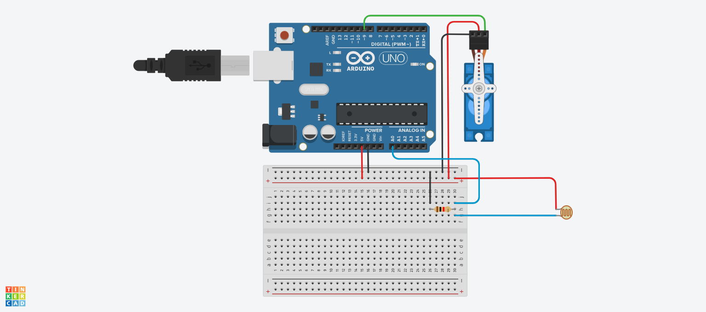

# 🦖 Chrome Dino Game Arduino Hack

Welcome to the prehistoric world of *hands-free gaming*! This quirky little project lets you automate the **Chrome Dino Game** using an **Arduino Uno**, a **photoresistor**, and a **servo motor**. 🤖🦕

---

## 🎬 What It Does

Using light detection and a servo-powered "jump," this Arduino setup plays the Chrome Dino Game for you. Just sit back, relax, and let your electronic dino conquer the desert 🏜️🌵.

---

## 🛠 Hardware Setup

### 🔧 What You’ll Need

- 🧠 Arduino Uno  
- 🌞 Photoresistor (LDR)  
- 💪 Servo motor (for jumping)  
- 🧵 Jumper wires  
- 🧱 Breadboard  
- ⚡ USB cable  

---

### 🖼️ Visual References

#### 🪛 Breadboard Layout

#### 📐 Schematics
Download the full schematic 👉 [Schematics.pdf](assets/Schematics.pdf)

#### 🛒 Parts List
Check the full bill of materials 👉 [componentlist.csv](assets/componentlist.csv)

---

Want the full code? Check it out here 👉 Arduino/chromedinogamecode.ino

### 🎉 Why Build This?
Because… why not? It’s fun, nerdy, and an awesome way to learn hardware interfacing, automate games...

### 📦 Future Ideas
1. Add a score display with an LCD screen 📟
2. Use a camera instead of an LDR for advanced AI dino vision 🎯

reminder for myself to test irl and upload a video of this in action

##### Made with caffeine ☕, cardboard circuits 🧃, and dino dreams 🦖💤
(reminder for myself to test irl and upload a video of this in action)
